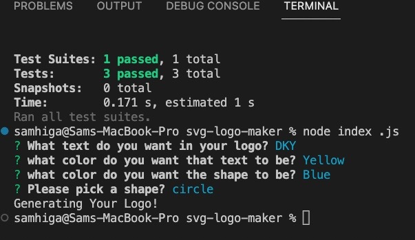

# svg-logo-maker

## Technology Used 

| Technology Used         | Resource URL           | 
| ------------- |:-------------:| 
| Git | [https://git-scm.com/](https://git-scm.com/)     | 
| Javascript | [https://developer.mozilla.org/en-US/docs/Web/JavaScript](https://developer.mozilla.org/en-US/docs/Web)   |
| Node.js | [https://nodejs.org/api/cli.html](https://nodejs.org/api/cli.html)   |
| SVG | [https://developer.mozilla.org/en-US/docs/Web/SVG](https://developer.mozilla.org/en-US/docs/Web/SVG)   |
| Jest | [https://jestjs.io/docs/getting-started](https://jestjs.io/docs/getting-started)   |
| NPM | [https://www.npmjs.com/](https://www.npmjs.com/)   |
| Inquirer | [https://www.npmjs.com/package/inquirer/v/8.2.4](https://www.npmjs.com/package/inquirer/v/8.2.4)   |


## Description 

Walkthrough Video [https://drive.google.com/file/d/1z9ssy0UEdhUgxShr56nhTteSMo44JukE/view]

This program can generate a logo based on a few user inputs that includes one of three shapes(triangle, square, or circle), up to three characters, and a variety of colors.


## Table of Contents 

* [Javascript Example](#javascript-example)
* [Usage](#usage)
* [Learning Points](#learning-points)
* [Author Info](#author-info)


## Javascript Example

To get a hold of this project, simply navigate to my Github profile and select the repo "svg-logo-maker". From there copy the SSH link into your terminal, Gitbash, or whatever application you prefer and use git copy and then paste link. You can then open it using VS Code and run it using node.


```javascript
  function init() {
  inquirer.prompt(questions).then(response => {
    console.log("Generating Your Logo!")
    let shape 
    if (response.shape === "triangle") {
        shape = new Triangle()
    } else if (response.shape === "square"){
        shape = new Square()
    } else {
        shape = new Circle()
    }
    shape.setColor(response.shapeColor)
    let svgInstance = new Svg ()
    svgInstance.setText(response.text, response.textColor)
    svgInstance.setShape(shape)
    writeToFile("test.svg", svgInstance.render())
  })

}
```

In the above code, I used this function that would take the user inputs of what shape they wanted, which were stored in the shapes.js file. It would then create a new svg file based off all of the user inputs and create the logo.


## Usage 

In order to use the SVG logo maker, you must first aquire it through GitHub, see above how to do this. After you open it in VS Code, you may then use your computer's terminal or the terminal in VS Code. Make sure you are inside this repository in the terminal, the run node index.js to begin. You will then be prompted various questions to help create the logo. After answering all the questions open the test.svg file to see your new logo!


</br>


## Learning Points 


Through this project, I got a better understanding of Node.js and how to run tests with jest. I got a good look into NPM and what it has to offer and some knowledge about SVG files as well.


## Author Info


### Sam Higa 


* [Portfolio](https://samhiga.github.io/my-portfolio/)
* [LinkedIn](https://www.linkedin.com/in/sam-higa-b887b9209/)
* [Github](https://github.com/samhiga)